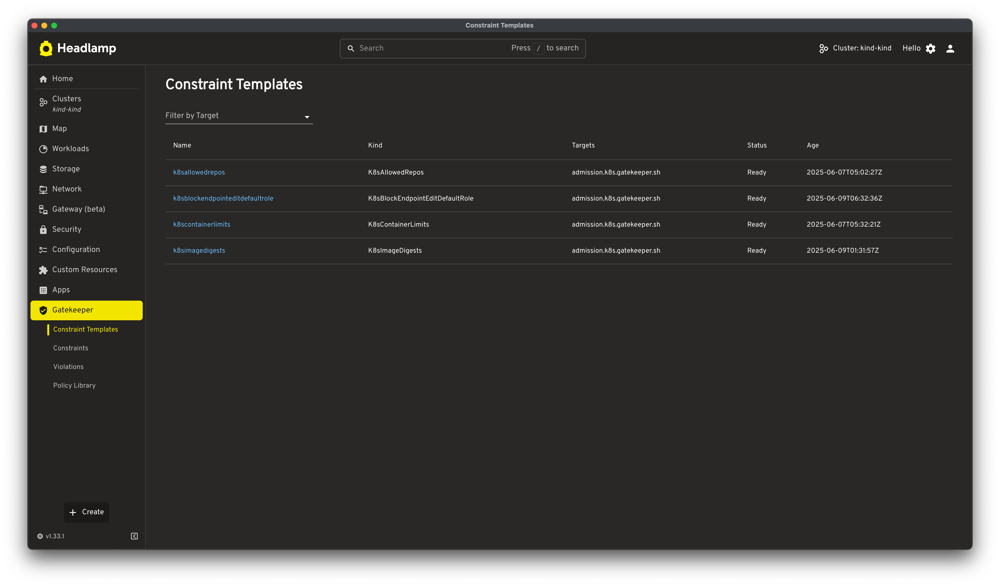
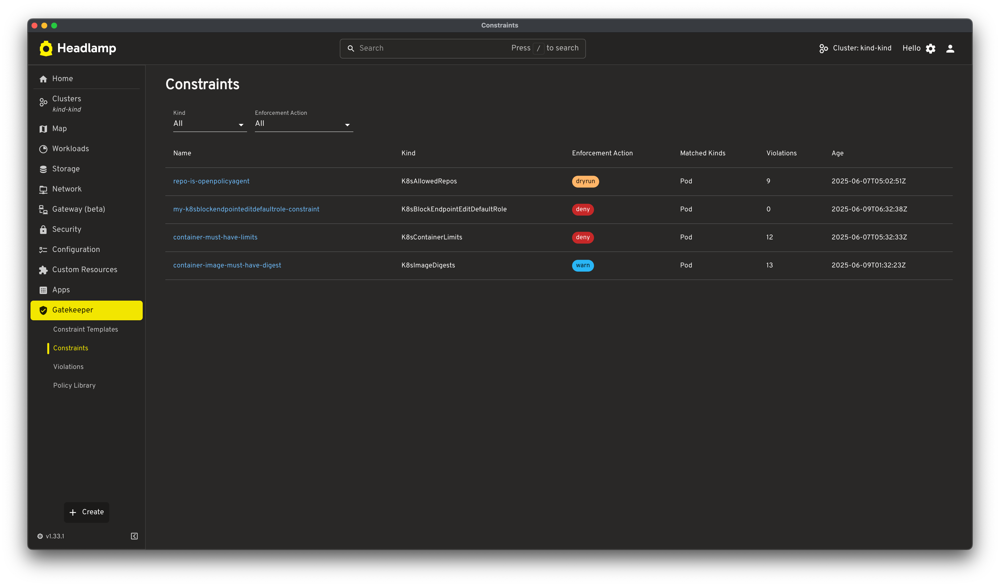
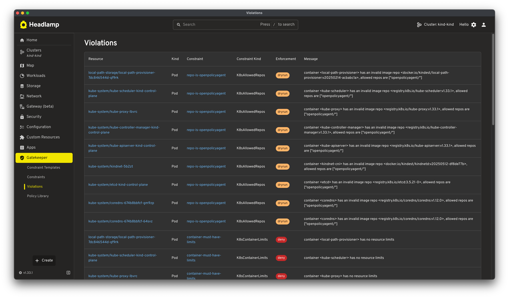
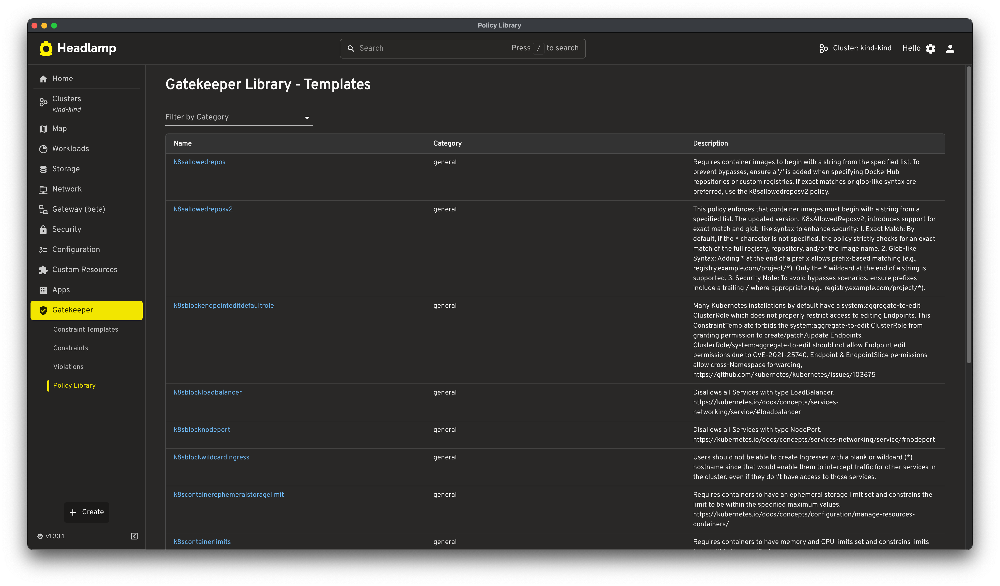
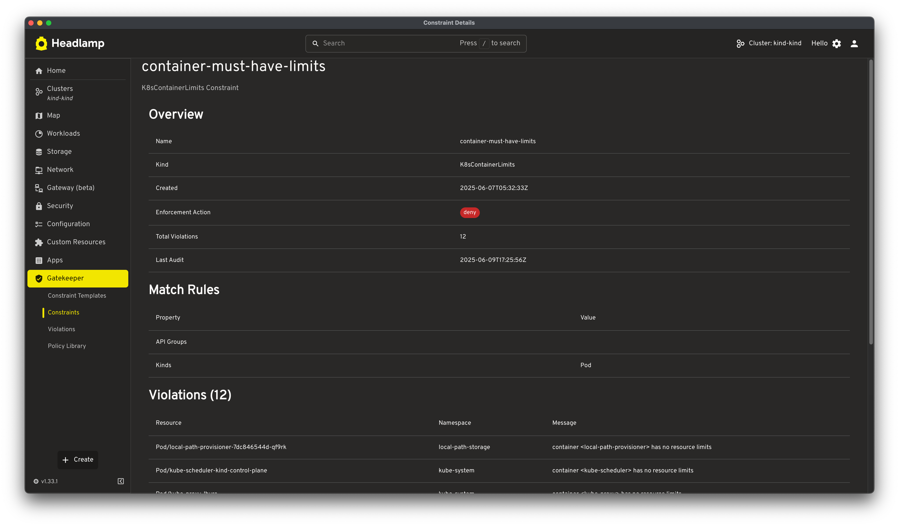

# Gatekeeper Headlamp Plugin

A Headlamp plugin for viewing and managing [OPA Gatekeeper](https://open-policy-agent.github.io/gatekeeper/) policies, violations, and a library of community-sourced templates in Kubernetes clusters.

## Features

- **ConstraintTemplates**: View Gatekeeper constraint templates.



- **Constraints**: Browse constraints with enforcement actions and match rules.



- **Violations**: Monitor policy violations across your cluster.



- **Gatekeeper Library**: Browse, customize, and apply ConstraintTemplates and Constraints from the OPA Gatekeeper Library.



- **Detailed Views**: Comprehensive details for templates and constraints.



## Prerequisites

- Headlamp installed and configured.
- A Kubernetes cluster with [OPA Gatekeeper installed](https://open-policy-agent.github.io/gatekeeper/website/docs/install/).
- Node.js and npm (or yarn).

## Installation & Development

This project uses a `Makefile` for common tasks.

1.  **Clone the repository:**
    ```bash
    git clone <repository-url>
    cd gatekeeper-headlamp-plugin
    ```

1.  **Setup & Initial Build:**
    Installs dependencies, builds the plugin, and deploys it to the default Headlamp plugins directory.
    ```bash
    make setup
    ```

1.  **Development Workflow:**
    Builds and deploys the plugin. Use this after making code changes.
    ```bash
    make dev
    ```

1.  **View all Makefile commands and documentation:**
    ```bash
    make help
    ```
    The Makefile is extensively documented with details on build processes, platform support, troubleshooting, and more.

### Loading the Plugin in Headlamp

After running `make deploy` (or `make setup`/`make dev`), the plugin should be available in your Headlamp plugins directory:
- Linux/macOS: `~/.config/Headlamp/plugins/gatekeeper-headlamp-plugin/`
- Windows: `%APPDATA%/Headlamp/plugins/gatekeeper-headlamp-plugin/`

Restart Headlamp if it was running. The "Gatekeeper" section will appear in the sidebar.

## Plugin Structure

- `src/index.tsx`: Main plugin entry point, routing, and sidebar integration.
- `src/model.ts`: Kubernetes custom resource class definitions and dynamic type discovery.
- `src/library/`: Components for the Gatekeeper Library feature.
- `src/constraint-template/`, `src/constraint/`, `src/violations/`: Components for respective views.
- `src/types/`: TypeScript type definitions.
- `hack/`: Build and utility scripts.

